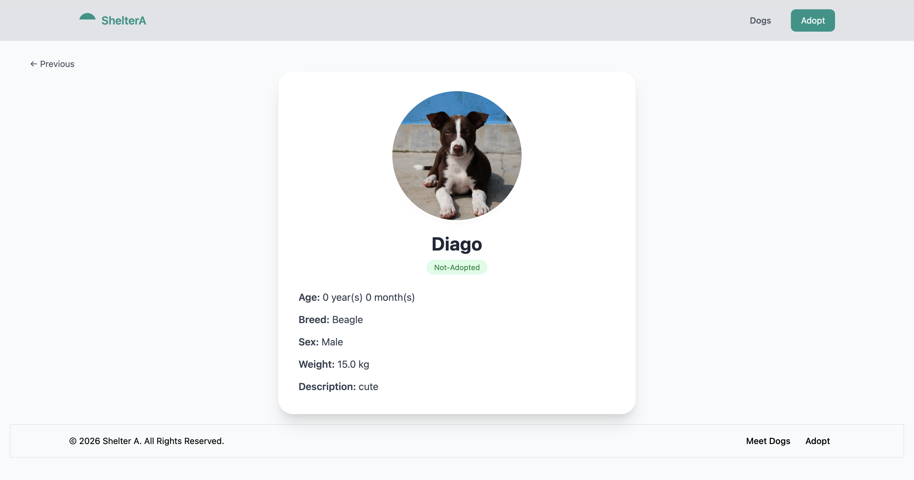
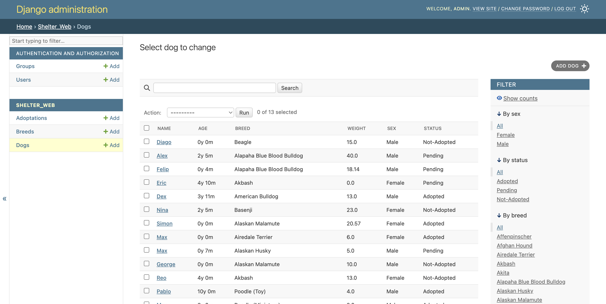
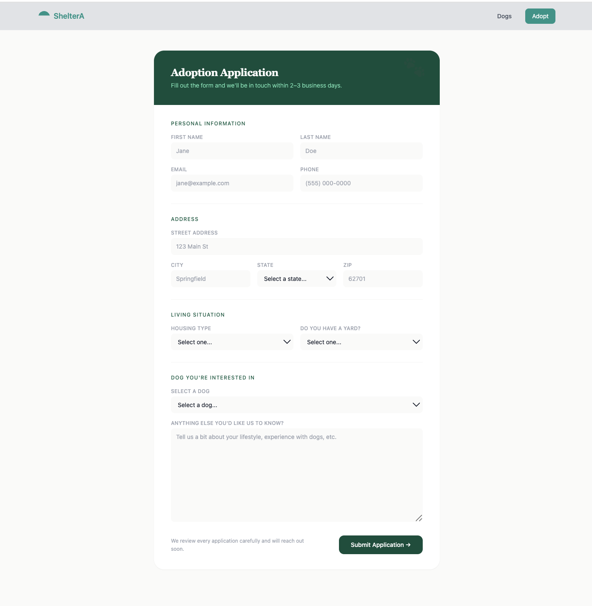

# 🐾 Dog Shelter Website

A dog adoption web application built with **Django** and **Tailwind CSS**. Users can browse dogs available for adoption, filter by breed or status, and submit an adoption application. Shelter staff can manage dogs and applications through the Django admin panel.

---
## 📸 Screenshots

| Dog List | Dog Detail | Admin Page |
|----------|------------|------------|
|  |  |   |



---

## ✨ Features

- Browse available dogs with filters by breed, sex, and status
- Dog detail page with photo, age, weight, and description
- Adoption application form with validation
- Admin panel for managing dogs, breeds, and adoption applications

---

## 🛠 Tech Stack

- Python / Django
- Tailwind CSS (CDN)
- JavaScript
- SQLite
- Django Admin

---

## 🚀 How to Run Locally

```bash
# Clone the repo
git clone https://github.com/your-username/shelter-website.git
cd shelter-website

# Create and activate virtual environment
python -m venv .venv
source .venv/bin/activate  # Windows: .venv\Scripts\activate

# Install dependencies
pip install -r requirements.txt

# Run migrations
python manage.py migrate

# Create a superuser for admin access
python manage.py createsuperuser

# Start the server
python manage.py runserver
```

Open [http://127.0.0.1:8000](http://127.0.0.1:8000) in your browser.
Admin panel is available at [http://127.0.0.1:8000/admin](http://127.0.0.1:8000/admin).

---

## 📁 Project Structure

```
shelter-website/
├── config/              # Django project settings and URLs
├── shelter_web/         # Main app
│   ├── models.py        # Dog, Breed, Adoptation models
│   ├── views.py         # View functions
│   ├── forms.py         # DogForm, AdoptionForm
│   ├── admin.py         # Admin configuration
│   └── templates/       # HTML templates
├── static/              # Static files (CSS, images)
├── media/               # Uploaded dog photos
└── requirements.txt
```

---
